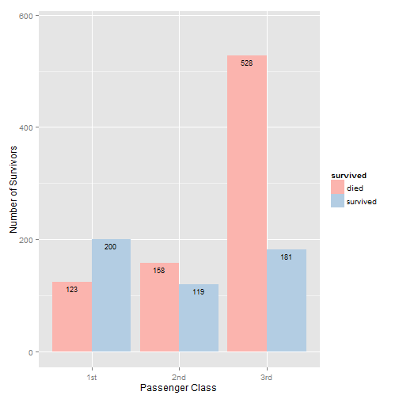

## Introduction to the Shiny Application
Backgroud: 
The sinking of the Titanic is one of the most infamous shipwrecks in history. On April 15, 1912, during her maiden voyage, the Titanic sank after colliding with an iceberg, killing 1502 out of 2224 passengers and crew. One of the reasons that the shipwreck led to such loss of life was that there were not enough lifeboats for the passengers and crew. Although there was some element of luck involved in surviving the sinking, some groups of people were more likely to survive than others, such as women, children, and the upper-class. -- Kaggle

Dataset:
The data set used in the application is 'ptitanic' from 'rpart.plot' package in R. 
The description of the data set can be found at: 
http://artax.karlin.mff.cuni.cz/r-help/library/rpart.plot/html/ptitanic.html. 
Variables included are passenger class, died or survived, gender, age, number of siblings or spouses aboard,
number of parents or children aboard. Data transformation were done on some of the variables to simplify the application.

prerequisite: R packages of "ggplot" and "plyr"

---

## Features of the Shiny Application 1
### VIsualize the survival rate of passengers with certain characteristics
 

---

## Features of the Shiny Application 2
### Caculate the survival rate of passengers with certain characteristics
<!-- html table generated in R 3.1.1 by xtable 1.7-4 package -->
<!-- Mon Jan 26 07:28:20 2015 -->
<table border=1>
<tr> <th>  </th> <th> Number of Passengers Died </th> <th> Number of Passengers Survived </th> <th> Survival Rate </th>  </tr>
  <tr> <td align="right"> 1st </td> <td align="right"> 123 </td> <td align="right"> 200 </td> <td align="right"> 0.62 </td> </tr>
  <tr> <td align="right"> 2nd </td> <td align="right"> 158 </td> <td align="right"> 119 </td> <td align="right"> 0.43 </td> </tr>
  <tr> <td align="right"> 3rd </td> <td align="right"> 528 </td> <td align="right"> 181 </td> <td align="right"> 0.26 </td> </tr>
   </table>

---

## Features of the Shiny Application 3
### Find the survival rate of a group of passengers
<!-- html table generated in R 3.1.1 by xtable 1.7-4 package -->
<!-- Mon Jan 26 07:28:20 2015 -->
<table border=1>
<tr> <th>  </th> <th> Variables </th> <th> You Selected: </th>  </tr>
  <tr> <td align="right"> 1 </td> <td> Passenger Class </td> <td> 1st </td> </tr>
  <tr> <td align="right"> 2 </td> <td> Gener </td> <td> male </td> </tr>
  <tr> <td align="right"> 3 </td> <td> Age Group </td> <td> 20-30 yrs </td> </tr>
  <tr> <td align="right"> 4 </td> <td> Passenger Aboard with Siblings/Spouses </td> <td> Yes </td> </tr>
  <tr> <td align="right"> 5 </td> <td> Passenger Aboard with Parents/Children </td> <td> Yest </td> </tr>
  <tr> <td align="right"> 6 </td> <td> Number of Passengers in the selected group </td> <td> 3 </td> </tr>
  <tr> <td align="right"> 7 </td> <td> Survival Rate of the selected group </td> <td> 0.67 </td> </tr>
   </table>
---
